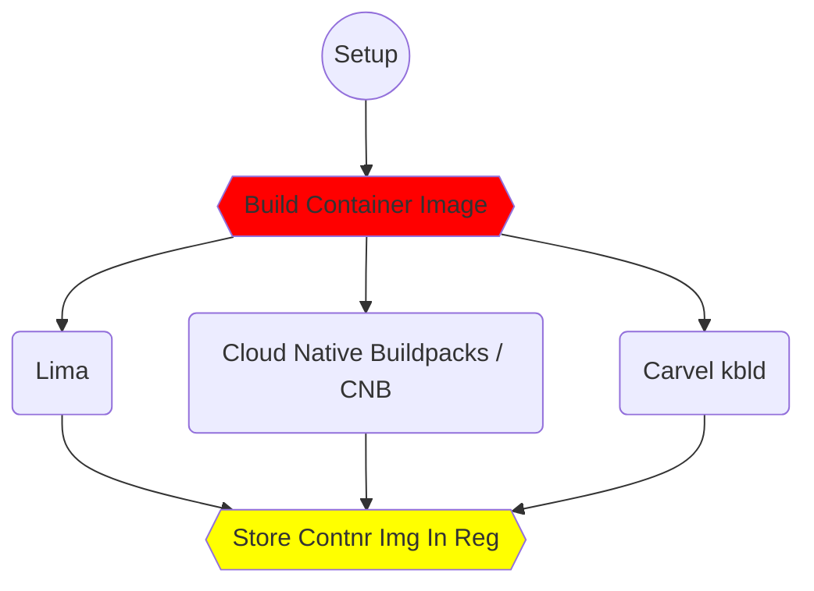

```{mermaid}
%%| label: fig-mermaid-flowchart
%%| fig-cap: Wow look how it flows.

graph LR
    A([Oooh]) --> B([Would You])
    B --> C([Look at This])
    C --> D[Very]
    C --> E[Fancy]
    C --> F[Flowchart]
```



